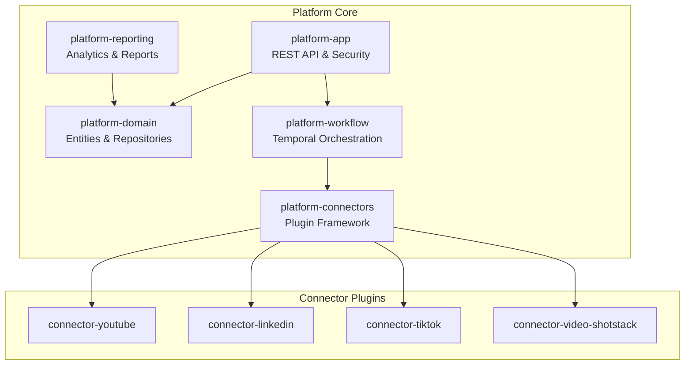

# Campus Catalyst CloudBot

AI-powered marketing automation platform for educational institutions.

## Overview

Campus Catalyst CloudBot enables colleges and universities to automate their digital marketing workflows:

- **Research** trending topics and keywords in the education domain
- **Plan** content strategies aligned with institutional goals
- **Generate** marketing assets including videos, captions, and blog posts
- **Publish** to multiple social platforms (YouTube, LinkedIn, TikTok)
- **Analyze** engagement metrics and generate performance reports

## Architecture



## Technology Stack

| Component | Technology |
|-----------|------------|
| Framework | Spring Boot 4.0.4 |
| Java | JDK 17+ |
| Database | PostgreSQL (H2 for dev) |
| Workflow | Temporal |
| Plugins | PF4J |
| Modularity | Spring Modulith |

## Prerequisites

- JDK 17+
- Maven 3.9+
- Docker (for Temporal and PostgreSQL in production)

## Getting Started

### 1. Clone the repository

```bash
git clone <repository-url>
cd campus-catalyst-cloudbot
```

### 2. Build the project

```bash
mvn clean install
```

### 3. Run the application

```bash
cd platform-app
mvn spring-boot:run
```

The application starts on `http://localhost:8080`

### 4. Verify it's running

```bash
curl http://localhost:8080/api/v1/health
```

### Development Tools

- **H2 Console**: http://localhost:8080/h2-console
  - JDBC URL: `jdbc:h2:mem:campuscatalyst`
  - Username: `sa`
  - Password: (empty)

- **Actuator**: http://localhost:8080/actuator/health

## Project Structure

```
campus-catalyst-cloudbot/
├── pom.xml                     # Parent POM
├── platform-app/               # Application entrypoint
│   └── src/main/java/
│       └── com/campuscatalyst/app/
│           ├── CampusCatalystApplication.java
│           ├── config/         # Security, etc.
│           └── controller/     # REST endpoints
├── platform-domain/            # Domain model
│   └── src/main/java/
│       └── com/campuscatalyst/domain/
│           ├── common/         # Base classes, enums
│           ├── tenant/         # Tenant, User entities
│           └── campaign/       # Campaign entity
├── platform-workflow/          # Temporal workflows (coming soon)
├── platform-connectors/        # Plugin framework (coming soon)
├── platform-reporting/         # Reports & analytics (coming soon)
└── connector-*/                # Platform connectors (coming soon)
```

## Adding a New Connector Plugin

1. Create a new module: `connector-<platform>`
2. Implement the connector interfaces from `platform-connectors`
3. Create a plugin manifest in `src/main/resources/plugin.properties`
4. Build the plugin JAR
5. Deploy to the `/plugins` directory

Detailed documentation coming soon.

## Configuration

### Environment Variables (Production)

| Variable | Description |
|----------|-------------|
| `DB_HOST` | PostgreSQL host |
| `DB_PORT` | PostgreSQL port (default: 5432) |
| `DB_NAME` | Database name |
| `DB_USERNAME` | Database username |
| `DB_PASSWORD` | Database password |

### Profiles

- `default` - Development with H2 in-memory database
- `prod` - Production with PostgreSQL

## License

Proprietary - All rights reserved.

## Contributing

Internal development only. Contact the platform team for access.
