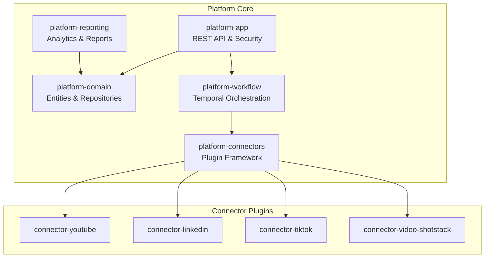

# Campus Catalyst CloudBot

AI-powered marketing automation platform for educational institutions.

## Overview

Campus Catalyst CloudBot enables colleges and universities to automate their digital marketing workflows:

- **Research** trending topics and keywords in the education domain
- **Plan** content strategies aligned with institutional goals
- **Generate** marketing assets including videos, captions, and blog posts
- **Publish** to multiple social platforms (YouTube, LinkedIn, TikTok)
- **Analyze** engagement metrics and generate performance reports

## Security Baseline

- All APIs require HTTP Basic authentication. Provide credentials via environment variables: `SECURITY_ADMIN_USERNAME/SECURITY_ADMIN_PASSWORD` (admin) and `SECURITY_API_USERNAME/SECURITY_API_PASSWORD` (standard user).
- Health checks (`/api/v1/health`, `/actuator/health`) remain public; all other endpoints (including Actuator) are authenticated.
- Default dev database uses H2 in-memory with non-blank credentials (`sa` / `dev-only-change-me`). Change them for any shared environment.
- H2 console is available for local development only at `/h2-console` and is protected by the same HTTP Basic auth.
- Dependency scanning and tests are mandatory in CI and release pipelines.

## Architecture



## Technology Stack

| Component | Technology |
|-----------|------------|
| Framework | Spring Boot 4.0.4 |
| Java | JDK 17+ |
| Database | PostgreSQL (H2 for dev) |
| Workflow | Temporal |
| Plugins | PF4J |
| Modularity | Spring Modulith |

## Prerequisites

- JDK 17+
- Maven 3.9+
- Docker (for Temporal and PostgreSQL in production)

## Getting Started

### 1. Clone the repository

```bash
git clone <repository-url>
cd campus-catalyst-cloudbot
```

### 2. Build the project

```bash
mvn clean install
```

### 3. Run the application

```bash
cd platform-app
mvn spring-boot:run
```

The application starts on `http://localhost:8080` with HTTP Basic auth enabled.

### 4. Verify it's running

```bash
curl http://localhost:8080/api/v1/health
```

### 5. Load Connector Plugins (Optional)

Place plugin JARs in the `/plugins` directory:
```bash
mkdir -p plugins
cp connector-youtube/target/connector-youtube-*.jar plugins/
cp connector-linkedin/target/connector-linkedin-*.jar plugins/
cp connector-tiktok/target/connector-tiktok-*.jar plugins/
cp connector-video-shotstack/target/connector-video-shotstack-*.jar plugins/
```

The ConnectorPluginManager will automatically discover and load them on startup.

### Development Tools

- **H2 Console (dev only)**: http://localhost:8080/h2-console
  - JDBC URL: `jdbc:h2:mem:campuscatalyst`
  - Username: `sa`
  - Password: `dev-only-change-me`

- **Actuator**: http://localhost:8080/actuator/health

## Adding a New Connector Plugin

To extend the platform with a new social media or service connector:

### 1. Create the Module

```bash
mvn archetype:generate \
  -DgroupId=com.campuscatalyst \
  -DartifactId=connector-instagram \
  -DarchetypeArtifactId=maven-archetype-quickstart
```

### 2. Add Parent POM

```xml
<parent>
    <groupId>com.campuscatalyst</groupId>
    <artifactId>campus-catalyst-cloudbot</artifactId>
    <version>1.0.0-SNAPSHOT</version>
</parent>
```

### 3. Implement Connector Interfaces

```java
@Component
public class InstagramPublisherConnector implements PublisherConnector {
    @Override
    public PublicationResult publish(PublishRequest request) {
        // Implementation
    }

    @Override
    public void cancelScheduled(String publicationId) {
        // Implementation
    }
}
```

### 4. Create Plugin Entry Point

```java
public class InstagramPlugin extends Plugin {
    public InstagramPlugin(PluginWrapper wrapper) {
        super(wrapper);
    }

    @Override
    public void start() {
        ConnectorRegistry.register("instagram", new InstagramPublisherConnector());
    }
}
```

### 5. Configure Plugin Manifest

Create `src/main/resources/META-INF/MANIFEST.MF`:
```
Plugin-Version: 1.0.0
Plugin-Id: connector-instagram
Plugin-Class: com.campuscatalyst.connector.instagram.InstagramPlugin
Plugin-Provider: Campus Catalyst
```

### 6. Build and Deploy

```bash
mvn clean package
cp target/connector-instagram-*.jar ../plugins/
```

Restart the application and the plugin will be automatically discovered and loaded.

## Project Structure

```
campus-catalyst-cloudbot/
├── pom.xml                           # Parent POM with multi-module config
│
├── platform-domain/                  # Core domain entities & repositories
│   ├── tenant/                       # Multi-tenant support (Tenant, User)
│   ├── campaign/                     # Campaign lifecycle management
│   ├── research/                     # SEO research (ResearchJob, Keyword, TopicCluster)
│   ├── content/                      # Content planning (ContentPlan, ContentAsset)
│   ├── media/                        # Media assets (VideoAsset, RenderStatus)
│   ├── publishing/                   # Publication tracking & status
│   ├── reporting/                    # Report definitions
│   └── analytics/                    # Metric snapshots
│
├── platform-app/                     # Spring Boot REST API application
│   ├── controller/api/               # REST endpoints (/api/v1/*)
│   │   ├── TenantController.java     # Tenant CRUD
│   │   ├── CampaignController.java   # Campaign CRUD & orchestration
│   │   └── ReportController.java     # Report generation & retrieval
│   ├── service/                      # Business logic
│   │   ├── TenantService.java        # Tenant management
│   │   └── CampaignService.java      # Campaign orchestration
│   ├── config/                       # Spring Security, database config
│   └── CampusCatalystApplication.java
│
├── platform-connectors/              # Connector framework & plugin system
│   ├── api/                          # Connector interfaces
│   │   ├── PublisherConnector.java   # Multi-platform publishing
│   │   ├── AnalyticsConnector.java   # Metrics retrieval
│   │   ├── VideoGenerator.java       # Video generation
│   │   └── SearchProvider.java       # SEO research
│   ├── model/                        # Data transfer objects
│   │   ├── PublishRequest
│   │   ├── VideoRenderRequest
│   │   ├── SearchRequest
│   │   ├── MetricsRequest
│   │   └── RateLimitInfo
│   └── plugin/                       # Plugin management
│       ├── ConnectorRegistry.java    # Plugin discovery & registration
│       └── ConnectorPluginManager.java # PF4J lifecycle
│
├── platform-workflow/                # Temporal.io workflow orchestration
│   ├── campaign/
│   │   ├── CampaignWorkflow.java     # Workflow interface
│   │   ├── CampaignWorkflowImpl.java  # Workflow implementation
│   │   ├── CampaignActivities.java   # Activity interfaces
│   │   └── CampaignActivitiesImpl.java # Activity implementations
│
├── platform-reporting/               # Analytics & report generation
│   ├── model/                        # Data models
│   │   ├── NormalizedMetric.java     # Platform-agnostic metrics
│   │   └── CampaignReportData.java   # Aggregated report data
│   └── service/                      # Report services
│       ├── ReportGeneratorService.java
│       └── ReportExportService.java
│
├── connector-youtube/                # YouTube publishing & analytics plugin
│   ├── YouTubePlugin.java
│   ├── YouTubePublisherConnector.java
│   └── YouTubeAnalyticsConnector.java
│
├── connector-linkedin/               # LinkedIn publishing plugin
│   ├── LinkedInPlugin.java
│   └── LinkedInPublisherConnector.java
│
├── connector-tiktok/                 # TikTok publishing plugin
│   ├── TikTokPlugin.java
│   └── TikTokPublisherConnector.java
│
└── connector-video-shotstack/        # Shotstack video generation plugin
    ├── ShotstackPlugin.java
    ├── ShotstackVideoGenerator.java
    └── CollegeCampaignTemplate.java
```

## REST API Endpoints

All endpoints require HTTP Basic authentication.

### Tenant Management
```
GET    /api/v1/tenants                     # List all tenants
POST   /api/v1/tenants                     # Create new tenant
GET    /api/v1/tenants/{id}                # Get tenant details
PUT    /api/v1/tenants/{id}                # Update tenant
DELETE /api/v1/tenants/{id}                # Deactivate tenant
```

### Campaign Management
```
GET    /api/v1/campaigns                   # List campaigns
POST   /api/v1/campaigns                   # Create campaign
GET    /api/v1/campaigns/{id}              # Get campaign details
PUT    /api/v1/campaigns/{id}              # Update campaign
DELETE /api/v1/campaigns/{id}              # Cancel campaign
GET    /api/v1/campaigns/{id}/status       # Get campaign execution status
POST   /api/v1/campaigns/{id}/pause        # Pause campaign
POST   /api/v1/campaigns/{id}/resume       # Resume paused campaign
```

### Reporting & Analytics
```
GET    /api/v1/reports                     # List reports
POST   /api/v1/reports                     # Generate new report
GET    /api/v1/reports/{id}                # Get report details
GET    /api/v1/reports/{id}/export?format=pdf|excel|csv|json
```

## Core Modules

### platform-domain
**Core domain entities and repositories**
- Multi-tenant support with automatic context isolation
- Campaign lifecycle (Draft → Published → Analyzing → Completed)
- Research entities (ResearchJob, Keyword, TopicCluster, IntentType)
- Content planning (ContentPlan, ContentAsset, ContentAssetType)
- Media management (VideoAsset, RenderStatus)
- Publishing tracking (Publication, PublicationStatus)
- Reporting (Report, ReportType, ReportStatus)
- Analytics snapshots (MetricSnapshot)

### platform-connectors
**Pluggable connector framework using PF4J**
- Abstraction layer for external service integration
- Four core connector types:
  - **PublisherConnector**: Multi-platform content publishing
  - **AnalyticsConnector**: Unified metrics retrieval
  - **VideoGenerator**: AI video creation service
  - **SearchProvider**: SEO keyword research
- Hot-swappable plugin architecture
- Connector registry for runtime discovery
- Rate limiting and quota management

### platform-workflow
**Temporal.io-based campaign orchestration**
- **CampaignWorkflow**: Orchestrates full campaign lifecycle
  - Research phase: Keyword and trend analysis
  - Content phase: AI-powered asset generation
  - Video phase: Async video rendering with polling
  - Publishing phase: Multi-platform distribution
  - Analytics phase: Metrics collection and aggregation
- **CampaignActivities**: Individual workflow steps
  - Saga pattern with automatic compensation on failures
  - Retry policies and timeout management
  - Heartbeat monitoring for long-running operations

### platform-reporting
**Analytics aggregation and report generation**
- **ReportGeneratorService**
  - Cross-platform metrics consolidation
  - Period-based comparisons (daily, weekly, monthly)
  - ROI calculations and trend analysis
- **ReportExportService**
  - PDF with custom branding
  - Excel with pivot tables
  - CSV for data import
  - JSON for API responses

### REST API Application (platform-app)
- Spring Boot 4.0.4 with embedded Tomcat
- HTTP Basic authentication with admin/API roles
- Multi-tenant context filtering
- Comprehensive error handling
- Health checks and actuator endpoints

## Connector Plugins

### YouTube Connector (connector-youtube)
**YouTube Data API v3 + YouTube Analytics API**
- **Publishing**: Upload videos with metadata, scheduling, privacy controls
- **Analytics**: Views, likes, comments, watch time, subscriber growth
- Resolves for: Long-form educational content, tutorials, campus tours

### LinkedIn Connector (connector-linkedin)
**LinkedIn Marketing API**
- **Publishing**: Share to personal profile or company page
- **Rich media**: Text, images, articles, documents with link previews
- Resolves for: B2B marketing, professional content, institutional announcements

### TikTok Connector (connector-tiktok)
**TikTok Content Posting API**
- **Publishing**: Upload short-form videos (up to 10 minutes)
- **Controls**: Captions, hashtags, privacy settings, duet/stitch permissions
- Resolves for: Gen-Z engagement, viral campaigns, short-form storytelling

### Shotstack Connector (connector-video-shotstack)
**Shotstack Edit API for programmatic video creation**
- **Video Generation**: Automated video rendering with pre-built templates
- **Templates**: Campus tours, program highlights, testimonials, event promos
- **Customization**: Branding, text overlays, music, transitions
- **Outputs**: MP4, GIF, WebM in multiple resolutions (SD, HD, FHD)
- Resolves for: Scalable video content without manual editing

## Campaign Workflow Example

```
1. RESEARCH PHASE
   └─ SearchProvider executes keyword research
   └─ Identifies trending topics in education domain

2. CONTENT PLANNING PHASE
   └─ AI content generator creates article outlines
   └─ Multiple variations per platform (YouTube, LinkedIn, TikTok)

3. VIDEO GENERATION PHASE (Async)
   └─ ShotstackVideoGenerator submits render job
   └─ Polls status until completion or timeout
   └─ Falls back to text-only content if rendering fails

4. PUBLISHING PHASE (Parallel)
   └─ YouTubePublisherConnector publishes video
   └─ LinkedInPublisherConnector shares professional version
   └─ TikTokPublisherConnector posts short-form version
   └─ All scheduled for optimal engagement times

5. ANALYTICS PHASE
   └─ YouTubeAnalyticsConnector collects viewing metrics
   └─ LinkedInAnalyticsConnector tracks engagement
   └─ Metrics normalized and consolidated in reports

6. REPORTING PHASE
   └─ ReportGenerator aggregates all metrics
   └─ ExportService renders PDF, Excel, CSV, JSON
```

## Configuration

### Environment Variables (Production)

| Variable | Description |
|----------|-------------|
| `DB_HOST` | PostgreSQL host |
| `DB_PORT` | PostgreSQL port (default: 5432) |
| `DB_NAME` | Database name |
| `DB_USERNAME` | Database username |
| `DB_PASSWORD` | Database password (required) |
| `SECURITY_ADMIN_USERNAME` | Admin account username (defaults to `admin`) |
| `SECURITY_ADMIN_PASSWORD` | Admin account password (required) |
| `SECURITY_API_USERNAME` | API user username (defaults to `api`) |
| `SECURITY_API_PASSWORD` | API user password (required) |

### Profiles

- `default` - Development with H2 in-memory database
- `prod` - Production with PostgreSQL

## Development Phases

The project has been developed in incremental phases, each focusing on specific architectural components:

### Phase 1: Foundation (Part 1)
- Multi-module Maven project structure
- Spring Boot 4.0.4 + Spring Framework 7.0
- Java 17, Spring Modulith for modular architecture
- Base domain entities (Tenant, User, Campaign)
- Multi-tenant context isolation
- Spring Security configuration
- Health check endpoints

### Phase 2: Domain Model & REST API (Part 2)
- Extended domain entities (Research, Content, Media, Publishing, Analytics, Reporting)
- JPA repositories for all entities
- REST API layer with DTOs and mappers
- TenantService for management operations
- CampaignService for campaign lifecycle
- API endpoints for tenant, campaign, and report operations

### Phase 3: Workflow, Connectors & Plugins (This Phase)
**3.1 - Connector Framework**
- Platform-connectors module with PF4J plugin system
- Standardized connector interfaces (Publisher, Analytics, VideoGenerator, SearchProvider)
- Data models for multi-platform communication
- Plugin registry and lifecycle management

**3.2 - Workflow Engine**
- Platform-workflow module with Temporal.io integration
- Campaign workflow orchestration
- Individual activity implementations
- Saga pattern with automatic compensation

**3.3 - Reporting Module**
- Platform-reporting module with analytics services
- NormalizedMetric for platform-agnostic data
- ReportGenerator service for aggregation
- ReportExport service for multi-format delivery

**3.4 - Platform Connectors**
- YouTube connector: Publishing + Analytics
- LinkedIn connector: Professional publishing
- TikTok connector: Short-form video publishing
- Shotstack connector: AI video generation
- All packaged as PF4J plugins for hot-loading

## License

Proprietary - All rights reserved.

## Contributing

Internal development only. Contact the platform team for access.
